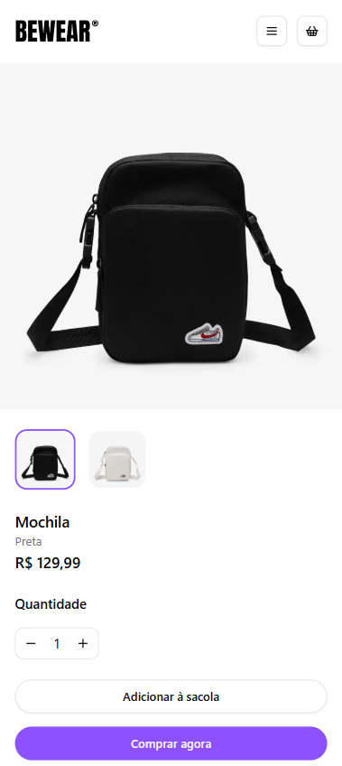
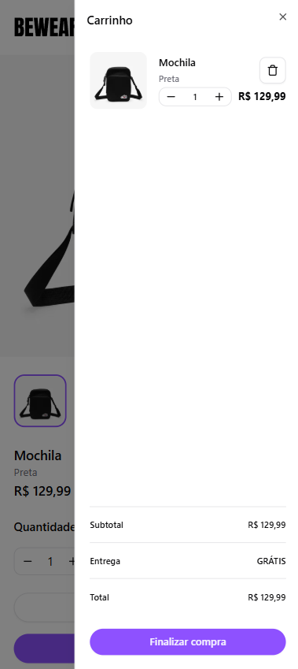
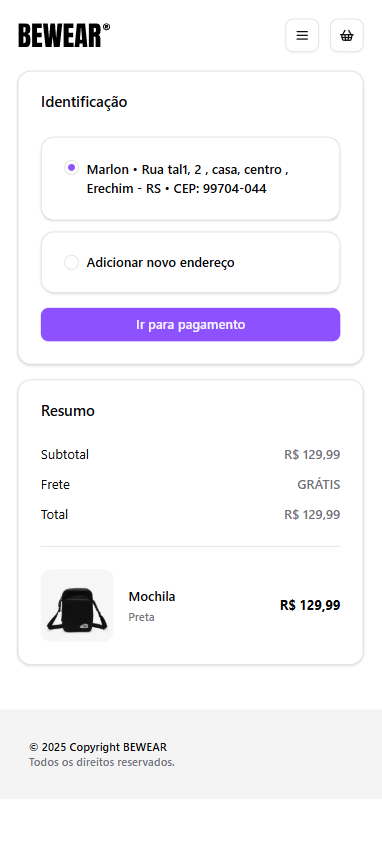
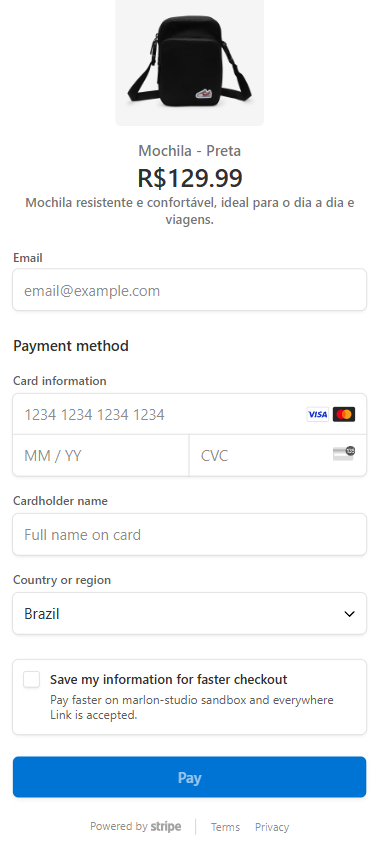
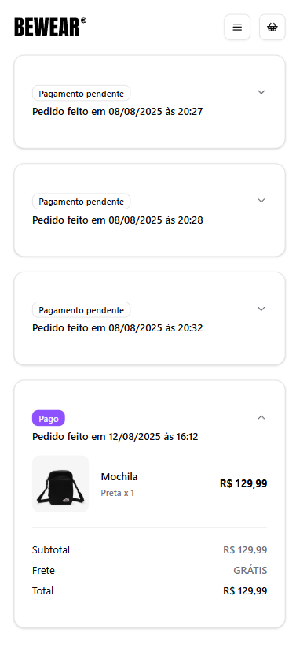

# BeWear 👕

Uma loja de roupas online moderna construída com Next.js, oferecendo uma experiência de compra fluida com integração completa ao Stripe para pagamentos seguros.

## ✨ Características

- 🛍️ **E-commerce Completo** - Catálogo de produtos, carrinho de compras e checkout
- 💳 **Pagamentos Seguros** - Integração com Stripe para processamento de pagamentos
- 🔐 **Autenticação** - Sistema de login e registro com Better Auth
- 🎨 **UI Moderna** - Componentes elegantes com Shadcn e Tailwind CSS
- ⚡ **Performance** - Construído com Next.js 15 e React 19
- 🗄️ **Banco de Dados** - PostgreSQL com Drizzle ORM

## 🚀 Tecnologias

- **Framework**: Next.js 15
- **Linguagem**: TypeScript
- **Estilização**: Tailwind CSS
- **UI Components**: Radix UI
- **Autenticação**: Better Auth
- **Banco de Dados**: PostgreSQL + Drizzle ORM
- **Pagamentos**: Stripe
- **Formulários**: React Hook Form + Zod
- **State Management**: TanStack Query

## 🚀 Live

Acesse <https://next-bewear.vercel.app/> para visualizar a aplicação.

## 📱 Screenshots

  
  
  
  
  
  

